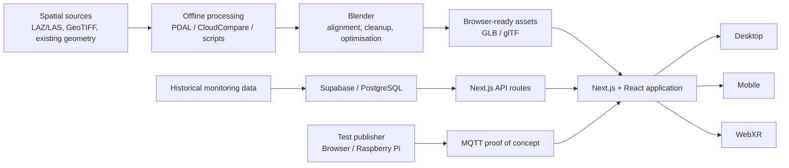

# Experimental Multi-Device Digital Twin for Dam Monitoring

## Overview

Dam monitoring information is often distributed across databases, spreadsheets, plots and specialised applications, making it difficult to relate measurements to their physical locations and to interpret spatial and temporal information together.

This project investigates how heterogeneous dam monitoring information can be brought together in a **spatial, browser-based and multi-device Digital Twin**. The monitoring-oriented prototype is centred on **Veiguinhas Dam (Montezinho Reservoir)** and combines an interactive 3D representation with spatially referenced monitoring markers, historical monitoring information, dashboards, charts and temporal controls.

The supported monitoring context includes:

- reservoir levels;
- weather and rainfall;
- piezometer metadata and historical measurements;
- seepage and percolation flows;
- temporary outlet and flow observations;
- inclinometer metadata, observation summaries and depth-dependent histories;
- monitoring events and timeline records.

The 3D environment provides spatial context and monitoring-element localisation, while conventional charts, tables and temporal controls preserve the numerical and temporal detail required for interpretation. The objective is to coordinate these representations within the same workflow rather than replace conventional monitoring views with a 3D model.

> **Important:** this repository contains a research prototype. It is **not an operational dam safety platform**, does not provide automatic engineering diagnosis or safety decisions and should not be used as a validated prediction system.

---

## Research Question

The dissertation is guided by the following research question:

> **How can heterogeneous dam monitoring information be integrated into a spatial, browser-based multi-device Digital Twin, and how do desktop, mobile and immersive interfaces support different monitoring activities?**

The implementation explores this question through the integration of monitoring data, browser-ready 3D assets, monitoring markers, temporal interaction and device-specific interfaces.

---

## Main Contributions

The project implements and documents:

- a **browser-based spatial Digital Twin research prototype** combining a 3D dam and terrain environment, reservoir context, monitoring markers, historical monitoring information, temporal controls and device-specific interaction;
- a **practical 3D asset preparation pipeline** for transforming point clouds, raster elevation data, RGB or classification information and existing geometry into browser-ready assets;
- the **coordination of spatial and analytical monitoring views**, linking monitoring-marker locations with metadata, historical records, charts and temporal controls;
- an **experimental MQTT communication path** in which externally published numerical values can modify a visible scene state;
- **device-specific interfaces** for desktop, mobile and WebXR rather than identical copies of the same interface;
- an **exploratory numerical-model visualisation workflow** for transferring prepared deformation states into browser-viewable assets or animations;
- a formative evaluation of the prototype and the complementary roles of 3D spatial context, analytical views and different device interfaces.

---

## Key Thesis Routes

The repository retains several development and numbered prototype routes because they document the iterative development of the research artefact.

The routes below are the most relevant to the completed thesis.

| Route | Role |
| --- | --- |
| `/montesinho11` | **Desktop reference interface.** The most complete monitoring implementation, combining the 3D scene, monitoring-marker interaction, historical dashboards, charts, temporal controls and reservoir-level playback. |
| `/montesinho11guide` | **Guided desktop evaluation variant.** Adds Portuguese and English guidance together with temporary marker-creation and positioning tasks used during evaluation. |
| `/montesinho11mobile` | **Reduced mobile interface.** Touch-oriented adaptation of the monitoring environment for rapid consultation and smaller screens. |
| `/vr11` | **Exploratory WebXR interface.** Immersive access to the dam environment, monitoring markers and selected in-scene information using hand-based interaction. |
| `/gebelim4` | **MQTT proof-of-concept route.** Demonstrates an external publisher-to-browser-to-scene communication path. |
| `/maptest2` | **Standalone map experiment.** Explores a geographic entry point for selecting among hard-coded dam locations before opening site-specific views. |

Additional prototype routes are intentionally retained as part of the development history and should not be interpreted as equivalent final interfaces.

---

## System Architecture

The prototype follows a modular browser-based architecture that separates source preparation, 3D asset preparation, monitoring-data access and device-specific presentation.



At runtime, the web application loads prepared assets rather than performing point-cloud reconstruction, mesh generation, decimation or texture baking in the browser.

Historical monitoring and MQTT are intentionally separate data paths. Historical information is accessed through database and API routes, while MQTT is used as a distinct near-real-time communication proof of concept.

---

## Technology Stack

### Web Application

- **Next.js** — application structure and App Router workflow
- **React** — component and state-driven interface
- **TypeScript** — application typing and maintainability
- **Three.js** — browser-based WebGL rendering
- **React Three Fiber** — integration of Three.js with the React component hierarchy
- **Drei** — helpers for model loading, controls and common 3D functionality
- **Tailwind CSS** — responsive interface styling
- **shadcn/ui** — reusable dashboard and interface components
- **Supabase / PostgreSQL** — backend baseline for historical monitoring data
- **MQTT / MQTT.js** — experimental near-real-time browser communication
- **Vercel** — deployment workflow used during development

### Offline 3D and Numerical Visualisation

- **Blender** — central asset preparation, alignment, optimisation and web export
- **CloudCompare** — point-cloud inspection, processing, classification review and reconstruction
- **PDAL** — scripted point-cloud processing and classification experiments
- **Python** — supporting spatial and data-processing scripts
- **ParaView / ParaViS** — inspection and processing of numerical-model results
- **Code_Aster / Salome-Meca** — numerical-model workflow explored for deformation visualisation

### Main Asset Formats

- LAZ / LAS
- TIFF / GeoTIFF
- PLY
- glTF / GLB

---

## 3D Environment and Spatial Interaction

The browser scene is implemented with Three.js through React Three Fiber.

It combines:

- dam and terrain geometry;
- reservoir context;
- an aligned lakebed;
- a separate water surface;
- monitoring markers;
- prepared terrain representations;
- environmental effects where enabled.

Prepared GLB/glTF assets are loaded at runtime. Keeping the terrain, water and monitoring-marker layers separate allows application state and monitoring values to modify visible scene elements without regenerating the underlying geometry.

Monitoring instruments are represented through selectable markers rather than being permanently embedded in the terrain mesh. Supported markers connect physical location with metadata, historical records, charts and temporal controls.

The marker configuration includes monitoring elements such as:

- levelling marks;
- reference levelling marks;
- pneumatic piezometers;
- vertical inclinometers;
- inclined inclinometers;
- a flow-measurement device;
- a reservoir-level gauge.

---

## Historical Monitoring Data

The desktop reference implementation accesses prepared historical monitoring information through Next.js API routes backed primarily by Supabase.

The main monitoring API paths are:

| Dataset | API Route |
| --- | --- |
| Hourly reservoir level | `/api/reservoir_level_hourly` |
| Manual reservoir-level observations | `/api/manual_cota_events` |
| Piezometer metadata | `/api/piezometer_metadata_latest` |
| Piezometer history | `/api/piezometer_history_long` |
| Seepage / percolation flows | `/api/seepage_flows_long` |
| Temporary outlet / flow observations | `/api/temporary_bica_flows_long` |
| Hourly weather / precipitation | `/api/weather_hourly` |
| Monitoring timeline events | `/api/timeline_events` |
| Inclinometer metadata | `/api/inclinometer_metadata` |
| Inclinometer observation summaries | `/api/inclinometer_observation_summary` |
| Inclinometer depth histories | `/api/inclinometer_history_long` |

The main desktop route uses these API paths rather than directly reading the development CSV exports.

An earlier inclinometer prototype also used a retained `/api/ipi` path based on historical data from an earlier development source. This path documents an earlier stage of the prototype and is not the source of the current case-study inclinometer dataset.

---

## Monitoring Dashboards

The monitoring dashboards complement the 3D environment with numerical and temporal information.

Depending on the selected monitoring source, information can be presented through:

- time-series charts;
- tables;
- metadata panels;
- summaries;
- date-range controls;
- status or quality information;
- inclinometer displacement profiles;
- reservoir-level and rainfall visualisations.

The 3D scene is used to communicate where a measurement originates and how monitoring elements relate spatially to the dam environment.

Charts, tables and dashboards remain responsible for precise numerical and temporal interpretation.

---

## Reservoir-Level Visualisation

The reservoir water surface is represented as an independent Three.js scene object so that its vertical position can change without modifying the terrain or lakebed.

The desktop interface can retrieve timestamp-ordered historical reservoir records for a selected interval and use them for visual playback.

The temporal interface provides controls for navigating the prepared historical sequence while the corresponding water surface changes visibly within the 3D environment.

This provides a spatial representation of recorded reservoir-level changes alongside their numerical values.

The moving water surface is a contextual visualisation of measured values. It is **not a hydraulic simulation** and does not estimate unmeasured reservoir behaviour.

---

## MQTT Proof of Concept

A separate MQTT experiment demonstrates that an externally published numerical value can reach the browser and modify a visible scene state.

The tested communication path included:

```text
Raspberry Pi or browser test publisher
        ↓
local Mosquitto / HiveMQ Cloud
        ↓
MQTT.js browser subscription
        ↓
React application state
        ↓
visible water-state update
```

The MQTT interface can distinguish connection states and display incoming messages together with their timestamps.

This experiment demonstrates technical communication only. It is not connected to an operational dam sensor network and does not validate production latency, reliability, security or safety-alert behaviour.

The MQTT demonstration therefore remains separate from the main historical monitoring workflow.

---

## Device-Specific Interfaces

The browser-first implementation provides distinct desktop, mobile and WebXR routes rather than three equivalent copies of the same interface.

The interfaces reuse the same monitoring context and spatial assets where appropriate, but adapt their interaction mechanisms and information density to the characteristics of each device.

### Desktop

The desktop reference route, `/montesinho11`, provides the most complete analytical workflow.

It combines the 3D environment with:

- orbit-style navigation;
- monitoring-marker selection;
- camera focus;
- metadata and monitoring panels;
- historical charts and tables;
- date-range controls;
- timeline interaction;
- historical reservoir-level playback;
- terrain-representation controls;
- interface feedback.

The larger display and mouse or pointer input allow spatial inspection and detailed analytical panels to remain available within the same workflow.

The desktop interface is therefore the reference research interface for detailed monitoring exploration.

### Mobile

The mobile route, `/montesinho11mobile`, reuses the main scene and application concepts through a reduced, touch-oriented layout.

The interface uses:

- larger touch targets;
- reduced initial information density;
- stacked views;
- touch-oriented interaction;
- simplified panel management;
- horizontally scrollable content where required.

The mobile implementation is best understood as a complementary interface for rapid or field-oriented consultation rather than as a complete duplicate of the desktop dashboard.

Historical monitoring functionality in the mobile implementation remained incomplete during development and should not be interpreted as having feature parity with the desktop interface.

### WebXR

The exploratory WebXR route, `/vr11`, was developed and tested through a browser-first workflow in the **Meta Quest 3** context.

The immersive interface focuses primarily on spatial exploration rather than reproducing the complete desktop dashboard.

The hand-based interaction system combines patterns including:

- ray-based pointing;
- distant selection;
- distant object manipulation;
- direct grabbing;
- repositioning;
- object rotation;
- two-handed scaling;
- direct touch-style interaction with in-scene controls;
- distant activation of supported controls.

Selected monitoring information is presented through Three.js in-scene panels because conventional desktop HTML overlays are not directly available inside immersive space.

The interaction mechanisms were also applied to experimental assets, including a drone-derived local 3D capture and an in-scene slider controlling playback of a prepared numerical deformation animation.

The WebXR implementation remains exploratory. Its main role is to support:

- structural scale;
- presence;
- marker localisation;
- spatial relationships;
- environmental understanding.

It is not intended to replace the detailed analytical workflow available on desktop.

---

## 3D Asset Preparation Pipeline

A substantial part of the project concerns the preparation of heterogeneous spatial information for browser delivery.

The general offline workflow is:

```text
Source data
    ↓
Inspection and preprocessing
    ↓
Geometry and appearance generation
    ↓
Alignment and optimisation in Blender
    ↓
GLB / glTF export
    ↓
Browser integration
```

Sources explored during the project include:

- LiDAR and point clouds;
- LAZ / LAS data;
- raster elevation data;
- TIFF / GeoTIFF;
- RGB information;
- classification information;
- terrain classification images;
- drone-derived spatial data;
- existing geometry;
- numerical-model outputs.

The project investigated several representation strategies:

- direct point-cloud rendering;
- point-cloud-derived meshes;
- vertex-colour meshes;
- classification-colour meshes;
- baked-texture meshes;
- raster-derived terrain;
- hybrid raster and point-cloud representations;
- script-assisted mesh generation.

No single representation was treated as universally preferable.

The appropriate representation depends on the intended balance among:

- spatial detail;
- visual realism;
- analytical clarity;
- processing complexity;
- transfer size;
- memory requirements;
- rendering cost;
- target-device constraints.

Blender acts as the main preparation boundary between heterogeneous spatial or analytical sources and the browser runtime.

Typical preparation operations include:

- asset import and inspection;
- coordinate and scale verification;
- scene organisation;
- mesh cleanup;
- normal correction;
- decimation;
- material preparation;
- vertex-colour configuration;
- UV unwrapping;
- texture baking;
- animation preparation;
- GLB/glTF export.

---

## Terrain Representations

Different terrain representations were explored throughout development.

Realistic RGB representations can support site recognition, while classification-based representations can emphasise analytical categories such as ground, vegetation, water and built elements.

The prototype includes runtime functionality for comparing prepared terrain representations within the same spatial context.

Classification representations should be interpreted carefully. Generated or heuristic classifications used during the project remain approximate and are not treated as authoritative semantic ground truth.

---

## Numerical-Model Visualisation

The project also explores a workflow for transferring prepared numerical deformation states into browser-viewable assets.

The investigated pipeline follows approximately:

```text
Numerical / finite-element source
        ↓
Code_Aster output
        ↓
ParaView / ParaViS
        ↓
Displacement and result visualisation
        ↓
Prepared surface mesh
        ↓
Blender states / animation
        ↓
GLB / glTF
        ↓
Browser presentation
```

Within the numerical workflow, displacement information can be used to generate a visible deformed state while analytical fields can be represented separately through colour.

Prepared states can then be transferred to Blender, converted into browser-ready assets and inspected interactively through Three.js.

A playback interface can be used to inspect intermediate visual states of a prepared deformation animation.

This represents a **visualisation pathway rather than numerical analysis performed in the browser**.

The numerical model used in the prototype was not validated against measured behaviour for the monitored case study. Its browser presentation therefore does not constitute:

- validated numerical prediction;
- engineering diagnosis;
- automatic structural assessment;
- automatic dam safety decision-making.

---

## Case Study

The principal monitoring case study is **Veiguinhas Dam**, located at the Montezinho Reservoir.

The dam contains several types of monitoring equipment distributed across the structure and its surroundings, including:

- levelling and reference marks;
- pneumatic piezometers;
- vertical inclinometers;
- inclined inclinometers;
- downstream flow measurement;
- reservoir-level monitoring.

The variety of observations provides a suitable environment for investigating how different measurements can be connected to their physical location within a Digital Twin.

**Gebelim** is used as a complementary asset-development and experimental context rather than as a second evaluated monitoring case study.

---

## Local Development

### Prerequisites

- Node.js
- npm

Install the project dependencies:

```bash
npm install
```

Start the development server:

```bash
npm run dev
```

The desktop reference interface can then be opened at:

```text
http://localhost:3000/montesinho11
```

---

## Environment Configuration

Environment-specific configuration is kept outside Git through `.env.local`.

The project requires environment configuration for the external services used by the relevant routes, particularly:

- Supabase;
- MQTT / broker configuration.

The following environment variables are used:

```env
NEXT_PUBLIC_MQTT_HOST=
NEXT_PUBLIC_MQTT_USERNAME=
NEXT_PUBLIC_MQTT_PASSWORD=
NEXT_PUBLIC_MQTT_TOPIC=

NEXT_PUBLIC_SUPABASE_URL=
NEXT_PUBLIC_SUPABASE_ANON_KEY=
```

Do not commit the real `.env.local` file or publish private credentials.

---

## Files Not Included in the Repository

Some local development datasets and large or experimental 3D assets are intentionally excluded from the Git repository:

```text
public/dam_supabase_csvs/
public/inclinometer_dt_csvs/
public/aguieiramodel.glb
public/montesinholayersDecim4tiles.glb
```

The prepared CSV directories were used during development and backend migration. The main desktop implementation retrieves the corresponding historical monitoring information through application API routes rather than directly reading these public CSV exports.

The excluded GLB files are local or large development assets and are not part of the tracked GitHub repository.

As a consequence, some experimental or earlier development routes may depend on local assets that are not distributed with the repository.

---

## Prototype Scope and Limitations

This repository should be interpreted as a **monitoring-oriented research artefact**.

The implemented system:

- is not an operational dam safety platform;
- is not connected to a production dam sensor network;
- does not provide automatic alarms or engineering safety decisions;
- uses MQTT as a separate communication proof of concept;
- includes historical-data components at different levels of migration and maturity;
- contains a reduced mobile implementation;
- treats WebXR and hand-based interaction as exploratory;
- presents prepared numerical-model results without claiming validated prediction;
- does not provide controlled performance benchmarks for latency, frame rate, memory use or hardware limits;
- represents one principal monitoring case study rather than a completed multi-dam platform.

These boundaries reflect the scope of the dissertation and are important when interpreting the implementation.

---

## Repository Context

This repository contains both the completed thesis implementation and earlier prototype iterations retained from the development process.

The numbered routes and experimental components reflect the iterative exploration of:

- browser-based 3D visualisation;
- terrain and spatial asset processing;
- monitoring-marker interaction;
- historical monitoring dashboards;
- Supabase integration;
- MQTT communication;
- mobile adaptation;
- WebXR;
- hand tracking and immersive interaction;
- numerical-model visualisation;
- multi-dam and map concepts.

The presence of an experimental route therefore does not imply that it represents the final interface used in the thesis.

For the most representative implementations, start with the routes listed in the **Key Thesis Routes** section.